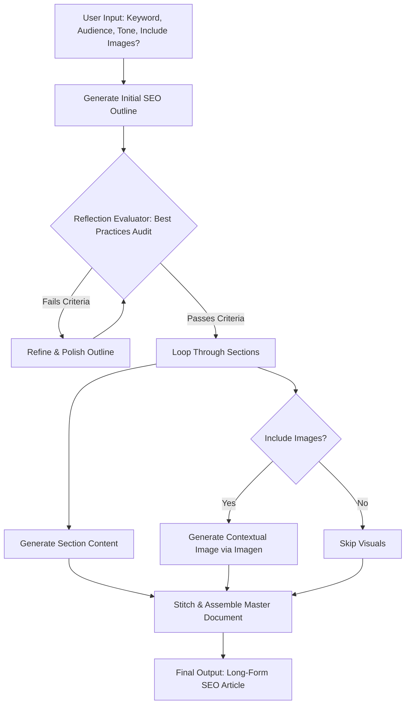

# 🚀 AI Long-Form Content & SEO Agent (Gemini + Opal Framework)

An agentic workflow built with **Google Opal** and the **Gemini API**. The agent accepts target keywords and parameters, generates an SEO-optimized outline, runs a self-correction reflection audit, and iteratively builds a comprehensive long-form article with optional AI-generated visuals.

---
## Summary & Vision
Problem
Traditional LLM text generation often produces generic, thin content with hallucinated facts and weak structure when asked to write long-form articles in a single prompt.

Solution
An automated, multi-step agentic workflow that breaks article creation into distinct cognitive stages: keyword analysis, structural outlining, self-correction/reflection, section-by-section drafting, optional visual asset generation, and automatic export to a styled Google Doc.

---
## Target Users & Key Personas

| Persona | Role | Primary Goals & Value Proposition |
| --- | --- | --- |
| **Target User** | **Software / AI Engineer** | Wants modular workflow definitions in Google Opal, well-structured Gemini API integrations, robust error handling, and clean code architecture to inspect, fork, or extend. |
| **End User** | **Marketing & SEO Content Lead** | Wants to input high-level parameters and receive high-ranking, thoroughly audited long-form articles published straight to Google Workspace without manual copy-pasting or formatting overhead. |

---


## 🔄 Agentic Workflow Diagram



## How to Deploy & Use

1. **Import to Google Opal:**
* Open [Google Opal Editor](https:/opal.google).
* Click **Import Workflow** and select `opal_workflow/workflow_definition.json`.

2. **Execute:**
* Run the Mini-App interface, enter your target keyword parameters, target audience, tone, and inspect the real-time node outputs.

---

## Repository Structure

```text
.
├── README.md                          # Main project homepage & executive summary
├── docs/                              # Deep-dive documentation & strategy
│   ├── PRD.md                         # Full Product Requirements Document
│   ├── architecture.md                # Node-by-node pipeline architecture & state flow
│   ├── prompt-strategy.md             # Deep dive into agent persona design & iteration
│   └── samples/                       # Raw markdown/doc exports of generated articles
│       ├── raw-sample-1.md
│       └── raw-sample-2.md
├── opal_workflow/
│   ├── workflow_definition.json       # Exported Opal visual pipeline spec
│   └── prompts/                       # Node-level system prompts
│       ├── 01_strategy_planner.txt
│       ├── 02_section_writer.txt
│       └── 03_reflection_critic.txt
```
