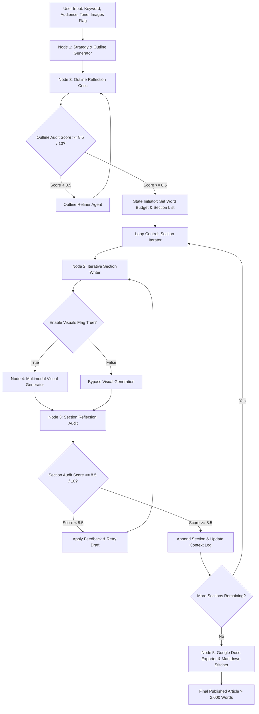

This document synthesizes your Product Requirements Document (PRD), prompt strategy, and multi-node Opal pipeline execution state into a clear, recruiter-ready technical blueprint. You can copy and paste this directly into `docs/architecture.md`.

---

# 🏗️ Pipeline Architecture & System State Flow

This document details the node-by-node architecture, state management, model routing logic, and self-correction reflection loops powering the **AI Agent for Long-Form SEO Content Generation**.

---

## 1. System Overview & Architectural Objectives

The pipeline is designed to solve the three primary failure modes of generative long-form writing: **context decay**, **repetitive prose**, and **generic search intent coverage**.

### Core Architecture Pillars
1. **Modular Section-by-Section Drafting**: Prevents context-window saturation and guarantees **2,000+ words** in final length by looping over individual H2/H3 headings.
2. **Deterministic Quality Audits**: Uses a dedicated **Reflection Critic** node evaluating outlines and drafts on a **10-point scoring matrix** prior to document assembly.
3. **Dynamic Model Tiering**: Dynamically routes complex reasoning and reflection tasks to **Gemini 3.1 Pro** while delegating high-throughput drafting to **Gemini 3 Flash**.

---

## 2. End-to-End Pipeline & State Flow Diagram



---

## 3. Detailed Node-by-Node Specifications

### Node 1: Strategy & Outline Generator

* **Default Model**: `gemini-3.1-pro` (Reasoning Tier)
* **Execution Type**: Single Pass / Autonomous Search
* **Role**: Deconstructs search intent, analyzes competitive gaps, and generates a structured H1/H2/H3 article outline.
* **Target Output**: Minimum of 5–8 distinct H2 headings, each with 2–3 supporting H3 subheadings and assigned sub-keyword intent.

### Node 2: Iterative Content Writer

* **Default Model**: `gemini-3-flash` (or Agent-Selected `gemini-3.1-pro`)
* **Execution Type**: Stateful Sequential Loop
* **Role**: Drafts 350 to 500 words per H2 section in isolation while reading from the global context history log (`written_history.log`).
* **Isolation Constraint**: Enforces a strict non-repetition directive prohibiting introductory re-hashes or conclusions of previous sections.

### Node 3: Self-Correction Reflection Audit (Critic Node)

* **Default Model**: `gemini-3.1-pro` (Reasoning Tier)
* **Execution Type**: Deterministic Evaluator (`temperature: 0.1`)
* **Role**: Evaluates both outlines and section drafts against a strict **10-point quality matrix**.
* **Pass Threshold**: **Score $\ge$ 8.5 / 10.0**. Scores below 8.5 trigger automatic routing back to Node 2 (or the Outline Refiner) with structured revision feedback.

### Node 4: Multimodal Visual Generator

* **Default Model**: `imagen-3.0-generate-002` / `Imagen 4`
* **Execution Type**: Conditional Trigger (`enable_images == True`)
* **Role**: Translates section text and H2 headings into photographic or conceptual image prompts, generating high-resolution 16:9 visual assets.

### Node 5: Google Docs Exporter

* **Default Model**: Workspace API Integration Node
* **Execution Type**: Programmatic Document Stitcher
* **Role**: Assembles raw markdown components into a formatted Google Doc with structured headings, bulleted lists, callout boxes, and inline visual embeds.

---

## 4. State Management & Data Schema

The Opal agent pipeline maintains global state across iterations using a central JSON state payload passed between nodes.

### Pipeline Runtime State Payload (`state_manifest.json`)

```json
{
  "session_id": "seo_agent_99842",
  "config": {
    "primary_keyword": "Agentic AI Workflows in Enterprise",
    "secondary_keywords": ["LLM orchestration", "Google Opal", "Gemini 3.1 Pro"],
    "target_audience": "CTOs and Enterprise Architects",
    "brand_tone": "Authoritative, technical, and data-backed",
    "enable_images": true,
    "min_word_count_target": 2000
  },
  "outline_state": {
    "version": 2,
    "audit_score": 9.2,
    "approved": true,
    "total_sections": 6,
    "sections": [
      {
        "id": "sec_01",
        "h2_heading": "## Understanding Agentic Orchestration in 2026",
        "target_word_count": 400,
        "keywords": ["LLM orchestration", "autonomous loops"]
      }
    ]
  },
  "execution_state": {
    "current_section_index": 2,
    "completed_sections": [
      {
        "section_id": "sec_01",
        "word_count": 465,
        "audit_score": 8.8,
        "image_url": "[https://drive.google.com/uc?id=img_01_hero](https://drive.google.com/uc?id=img_01_hero)"
      }
    ],
    "running_word_count": 912
  }
}

```

---

## 5. Quality Gate Logic: The 10-Point Reflection Scoring Matrix

The Reflection Critic (Node 3) evaluates outlines and drafts using a calibrated **10-point Rubric**:

| Score Range | Category Rating | Action Triggered |
| --- | --- | --- |
| **8.5 – 10.0** | **Publication Ready** | Approved. Advances state to the next section or final document assembly. |
| **7.0 – 8.4** | **Minor Deficiencies** | Conditional Reject. Routes actionable feedback string to Node 2 for targeted revision pass. |
| **0.0 – 6.9** | **Structural Failure** | Hard Reject. Clears section draft and triggers a complete rewrite under revised prompt constraints. |

### Evaluation Criteria (Weighted)

* **SEO Intent Alignment (30%)**: Are assigned sub-keywords placed naturally without stuffing?
* **Depth & Actionability (30%)**: Is the content supported by concrete examples, tables, or code snippets?
* **Context Isolation (20%)**: Is there zero repetition or preamble summarizing previous H2 sections?
* **E-E-A-T & Voice Adherence (20%)**: Does the tone match target audience guidelines while avoiding generic AI filler words (*"in today's digital landscape"*, *"delve"*, *"testament"*)?

---

## 6. Non-Functional Specifications & Fallbacks

* **Word Count Guarantee**: Guaranteed minimum of **2,000 words** achieved by enforcing 5–8 H2 sections with individual section word targets (350–500 words each).
* **Latency Benchmark**: Complete pipeline execution under **5 minutes** for a full 2,000+ word article including reflection loops and visual generation.
* **Max Retry Cap**: Max 3 retries per section. If a section fails to score $\ge 8.5$ after 3 attempts, the pipeline falls back to the highest-scoring draft iteration and logs a warning in state telemetry.
* **Rate-Limit Resilience**: Dynamic backoff logic automatically queues requests if API limits are hit during high-throughput section generation passes.

```

```
